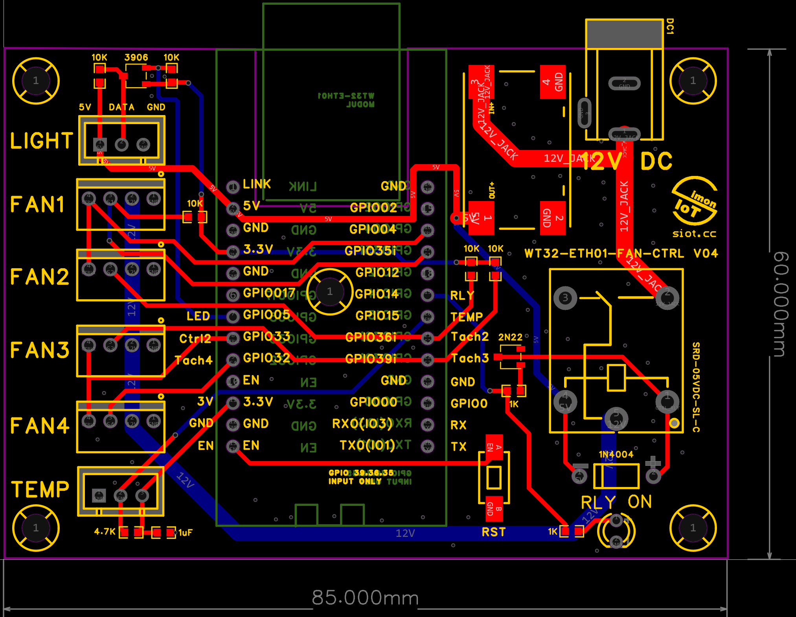

# WT32-ETH01 Smart Fan Controller (ESPHome)

English | [正體中文](README_zh-tw.md)

A fan controller project based on the **WT32-ETH01** ESP32 board. This project allows you to control 4 PWM PC fans (in 2 groups), monitor their RPM, control a WS2812 LED strip, and monitor system temperature via Home Assistant.



## 🚀 Features

* **Ethernet Connectivity**: Uses the onboard LAN8720 for stable, wired network connection.
* **Dual Zone PWM Control**:
    * Group 1: Fans 1 & 2
    * Group 2: Fans 3 & 4
* **RPM Monitoring**: Individual RPM feedback for all 4 fans.
* **Master Power Switch**: A relay control to cut off power to all fans completely.
* **LED Control**: Integrated WS2812 (Neopixel) driver using ESP32 RMT.
* **Temp Monitoring**: Support for DS18B20 temperature sensor.
* **Home Assistant Ready**: Native API integration.

## 🔌 Pin Configuration (Wiring Map)

| Component | Pin | Note |
| :--- | :--- | :--- |
| **Ethernet** | GPIO 0, 16, 18, 23 | Internal LAN8720 usage |
| **DS18B20** | GPIO 15 | Requires 4.7kΩ pull-up |
| **Fan Relay** | GPIO 14 | Master FAN power switch |
| **WS2812 LED** | GPIO 5 | Uses RMT driver |
| **PWM Group 1** | GPIO 4 | Controls Fan 1 & 2 speed |
| **PWM Group 2** | GPIO 33 | Controls Fan 3 & 4 speed |
| **TACH Fan 1** | **GPIO 35** | **Input Only. Requires ext. 10kΩ Pull-up** |
| **TACH Fan 2** | **GPIO 36** | **Input Only. Requires ext. 10kΩ Pull-up** |
| **TACH Fan 3** | **GPIO 39** | **Input Only. Requires ext. 10kΩ Pull-up** |
| **TACH Fan 4** | GPIO 32 | Uses internal Pull-up |

## ⚙️ Configuration

The YAML configuration is designed to be flexible. You can customize the following variable at the top of the file:

```yaml
substitutions:
  led_count: 60  # Change this to match your LED strip length
```

## 🧩 Code Explanation

**Fan Control Logic**

The configuration uses a proxy template to bridge the Home Assistant Fan component with the ESP32 hardware LEDC (PWM) output.

   * fan component: Creates the UI slider in Home Assistant.

   * output (template): Receives the speed value (0-100%) and converts it to a float (0.0-1.0).

   * output (ledc): Generates the actual 25kHz PWM signal required by standard PC fans.

**RPM Calculation**

Standard PC fans output 2 pulses per revolution. The code uses a multiplier of 0.5 to convert the raw pulse count (pulses/minute) into actual RPM.

```yaml
filters:
  - multiply: 0.5  # Convert 2 pulses/rev to 1 RPM
```

## 📦 Installation

  -  Install ESPHome.

  -  Copy the YAML code to your configuration.

  -  Compile and upload to your WT32-ETH01.

 *  Note: For the first flash, use a USB-TTL adapter connected to TX0/RX0 and ground GPIO0.

📄 License

[MIT License](LICENSE)
